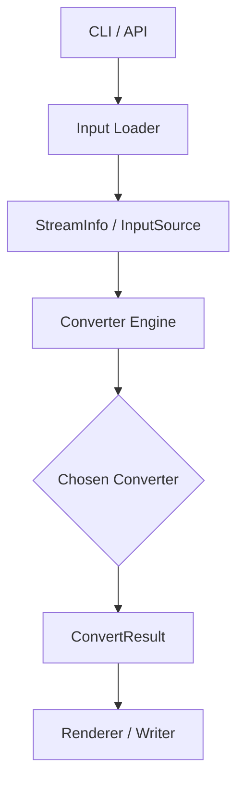

# MoonBitMark 架构改造方案

> **文档目的**：将 MoonBitMark 从"多格式转换工具"升级为"专业级文档转换引擎"

---

## 目录

- [1. 当前问题分析](#1-当前问题分析)
- [2. 目标架构愿景](#2-目标架构愿景)
- [3. 三层系统架构](#3-三层系统架构)
- [4. 分阶段改造方案](#4-分阶段改造方案)
- [5. 架构改造任务跟踪](#5-架构改造任务跟踪)
- [6. 实施优先级](#6-实施优先级)
- [7. 改造前后对比](#7-改造前后对比)

---

## 1. 当前问题分析

### 1.1 核心问题：架构意图未落地

> 你**已经开始设计架构了**，但项目真正运行时，**还没有按那套架构工作**。

仓库中已存在"架构意图"：

| 组件 | 文件 | 状态 |
|------|------|------|
| 统一结果类型 | `src/core/types.mbt` | ✅ 已定义 `ConvertResult` |
| 输入信息 | `src/core/types.mbt` | ✅ 已定义 `StreamInfo` |
| 转换器接口 | `src/core/types.mbt` | ✅ 已定义 `DocumentConverter` trait |
| 主引擎 | `src/core/engine.mbt` | ❌ 占位实现，仅返回 dummy |

### 1.2 实际运行现状

主程序 `cmd/main/main.mbt` 仍采用硬编码分支：

```
.txt  → TextConverter::convert
.csv  → CsvConverter::convert
.docx → DocxConverter::convert
.epub → EpubConverter::convert
URL   → HTML 转换器
```

**问题本质**：

> 现在真正运行的系统，是"一个个转换器直接拼起来的工具"；
> 而非"由统一引擎调度的一套文档转换框架"。

---

## 2. 目标架构愿景

### 2.1 产品定位升级

| 现状 | 目标 |
|------|------|
| 多格式 Markdown 转换工具 | **MoonBit 文档转换内核** |

### 2.2 核心特征

#### 特征 1：统一入口

所有输入走一条主路径：



#### 特征 2：统一转换器协议

每个转换器实现同一接口：

```moonbit
trait DocumentConverter {
  name() -> String
  accepts(info: StreamInfo) -> Bool
  convert(input: InputSource, ctx: ConvertContext) -> ConvertResult
}
```

#### 特征 3：统一结果模型

| 字段 | 类型 | 说明 |
|------|------|------|
| `markdown` | `String` | 转换后的 Markdown 文本 |
| `title` | `String?` | 文档标题 |
| `metadata` | `Map[String, String]` | 元数据 |
| `warnings` | `Array[String]` | 警告信息 |
| `assets` | `Array[Asset]` | 提取的资源文件 |
| `stats` | `ConvertStats?` | 转换统计 |

#### 特征 4：统一错误与诊断

专业级错误信息应包含：

```text
Error: XmlParseError
  ├─ Phase: epub/container
  ├─ Source: META-INF/container.xml
  ├─ Message: Invalid XML declaration encoding
  └─ Hint: Try UTF-8 fallback or inspect archive integrity
```

#### 特征 5：统一扩展机制

新增格式时只需"注册一个新的 converter"，无需修改 CLI 主函数。

---

## 3. 三层系统架构

```
┌─────────────────────────────────────────────────────────┐
│                    Frontends (前端层)                     │
│  ┌─────┐  ┌─────┐  ┌─────┐  ┌─────┐                     │
│  │ CLI │  │ Web │  │ MCP │  │ API │                     │
│  └──┬──┘  └─────┘  └─────┘  └─────┘                     │
├─────┼───────────────────────────────────────────────────┤
│     │              Core Engine (核心层)                  │
│     ▼                                                    │
│  ┌──────────────────────────────────────────┐           │
│  │ • 输入识别 • 转换器注册 • 转换器选择      │           │
│  │ • 统一错误 • 统一结果 • 统一诊断          │           │
│  └──────────────────────────────────────────┘           │
├─────────────────────────────────────────────────────────┤
│                Format Adapters (格式适配层)              │
│  ┌────┐ ┌────┐ ┌────┐ ┌────┐ ┌────┐ ┌────┐ ┌────┐     │
│  │TXT │ │CSV │ │JSON│ │PDF │ │HTML│ │DOCX│ │... │     │
│  └────┘ └────┘ └────┘ └────┘ └────┘ └────┘ └────┘     │
└─────────────────────────────────────────────────────────┘
```

**核心原则**：CLI 只是前端，不再是系统核心。

---

## 4. 分阶段改造方案

### 阶段一：架构意图落地

#### 4.1.1 扩充 Core 类型定义

**ConvertResult 升级**：

```moonbit
struct ConvertResult {
  markdown: String
  title: String?
  metadata: Map[String, String]
  warnings: Array[String]
  source_type: String
  stats: ConvertStats?
}
```

**ConvertStats 结构**：

| 字段 | 说明 |
|------|------|
| 字符数 | 文档总字符数 |
| 段落数 | 段落/单元格/幻灯片数量 |
| 耗时 | 转换耗时（毫秒） |
| 降级处理 | 是否使用了降级方案 |

#### 4.1.2 统一输入模型

```moonbit
enum InputSource {
  FileInput(path: String, bytes: Bytes?)
  UrlInput(url: String, fetched_html: String?)
  BytesInput(name: String?, bytes: Bytes, mimetype: String?)
}
```

#### 4.1.3 重写 DocumentConverter 接口

```moonbit
trait DocumentConverter {
  name() -> String              // 转换器名称
  priority() -> Int             // 优先级（高优先）
  accepts(info: StreamInfo) -> Bool
  convert(input: InputSource, ctx: ConvertContext) -> ConvertResult
}
```

**ConvertContext 配置项**：

- 是否保留 metadata
- 是否输出调试日志
- URL 抓取选项
- 最大文件大小 / 超时
- 资源输出目录
- 输出模式（纯文本 / 标准 Markdown / 带 frontmatter）

#### 4.1.4 实现 MarkItDown Engine

| 职责 | 说明 |
|------|------|
| 注册转换器 | 维护 converters 列表 |
| 识别输入 | 扩展名、MIME、URL、文件头特征 |
| 选择转换器 | 遍历 `accepts()`，取 priority 最高 |
| 执行转换 | 记录时间、捕获错误、补充 metadata |
| 返回结果 | 供 CLI/Web/MCP 共同使用 |

---

### 阶段二：CLI 降级为前端

| 改造前 | 改造后 |
|--------|--------|
| 解析参数 | 解析参数 |
| 判断格式 | 调用 `engine.convert(...)` |
| 调不同 converter | 渲染结果 / 写文件 |
| 写文件 | |
| 打印错误 | |

> **核心变化**：CLI 不再知道 DOCX、EPUB、PPTX 的存在，只知道给引擎输入、拿结果、输出。

---

### 阶段三：引入 AST 中间表示

#### 为什么需要 AST

| 叙事升级 |
|----------|
| 各格式直接转 Markdown → **各格式转 Document AST → Renderer 输出 Markdown** |

#### AST 设计

**Block 级元素**：

| 类型 | 字段 |
|------|------|
| Heading | `level: Int, text: String` |
| Paragraph | `inlines: Array[Inline]` |
| List | `items: Array[Block], ordered: Bool` |
| CodeBlock | `lang: String, content: String` |
| Quote | `blocks: Array[Block]` |
| Table | `headers: Array[String], rows: Array[Array[String]]` |
| HorizontalRule | — |

**Inline 级元素**：

`Text` | `Emphasis` | `Strong` | `Code` | `Link` | `Image` | `LineBreak`

**Document 结构**：

```moonbit
struct Document {
  title: String?
  metadata: Map[String, String]
  blocks: Array[Block]
}
```

#### 接入策略

**第一步**：HTML、DOCX、EPUB 先接入 AST（最具代表性）

**第二步**：TXT/CSV/JSON/PPTX/XLSX 逐步跟进

---

### 阶段四：诊断系统

#### 错误分类

```moonbit
enum ConversionError {
  InputError(message: String, source: String)
  FormatDetectionError(message: String)
  ZipError(message: String, file: String?)
  XmlParseError(message: String, line: Int?)
  UnsupportedFeatureError(feature: String, format: String)
  ConversionError(message: String, phase: String)
}
```

#### 错误信息结构

| 字段 | 示例 |
|------|------|
| category | `XmlParseError` |
| phase | `epub/container` |
| source | `META-INF/container.xml` |
| message | `Invalid XML declaration encoding` |
| hint | `Try UTF-8 fallback or inspect archive integrity` |

#### Warnings 机制

以下情况应记录 warning 而非直接失败：

- 某些样式丢失
- 某张图片未导出
- 某个工作表为空
- 某个幻灯片备注未处理

---

### 阶段五：转换流水线

```
┌──────┐   ┌───────┐   ┌───────┐   ┌───────────┐   ┌────────┐   ┌─────────────┐
│ Load │──▶│Detect │──▶│ Parse │──▶│ Normalize │──▶│ Render │──▶│ Postprocess │
└──────┘   └───────┘   └───────┘   └───────────┘   └────────┘   └─────────────┘
```

| 阶段 | 职责 |
|------|------|
| Load | 读文件 / 拉 URL / 解 ZIP |
| Detect | 扩展名、MIME、魔数、内部结构识别 |
| Parse | 转成领域对象 / AST |
| Normalize | 合并空白、清理无效节点、标题调整、表格对齐 |
| Render | 输出 Markdown |
| Postprocess | frontmatter、脚注、资源路径重写 |

---

### 阶段六：插件注册机制

```moonbit
fn register_converters(engine: Engine) -> Engine {
  engine
    |> register(TextConverter)
    |> register(CsvConverter)
    |> register(JsonConverter)
    |> register(PdfConverter)
    |> register(HtmlConverter)
    |> register(DocxConverter)
    |> register(PptxConverter)
    |> register(XlsxConverter)
    |> register(EpubConverter)
}
```

> 新增格式时，不改 engine 主体，只改注册表。

---

### 阶段七：资源与元数据输出

#### 输出模式

| 模式 | 输出 | 适用场景 |
|------|------|----------|
| 纯 Markdown | `output.md` | 日常使用 |
| Markdown + Metadata | `output.md` + `output.meta.json` | 调试、MCP、评测 |

---

## 5. 架构改造任务跟踪

> 状态说明：
> - `[x]` 已完成
> - `[~]` 已部分完成
> - `[ ]` 未开始

### P0：必须做

- [~] Core Engine 接管主流程
  当前状态：已新增独立 `src/engine/` 包，由引擎负责输入识别、converter 注册、选择与调度执行；metadata 补全、frontmatter 输出、基础 diagnostics 合并与 stats 默认生成已接入，但统一 typed error 体系仍未完成。
- [x] CLI 只调用 engine
  当前状态：`cmd/main/main.mbt` 已移除格式分支，改为调用引擎并输出 `ConvertResult.markdown`。
- [x] 所有 converter 返回 `ConvertResult`
  当前状态：text/csv/json/pdf/html/docx/pptx/xlsx/epub 已统一返回 `ConvertResult`，并已普遍填充 title、metadata、warnings、stats 等结果字段。
- [~] 统一错误/警告模型
  当前状态：`warnings`、`diagnostics`、`ConversionDiagnostic` 已接入 `ConvertResult` 与 engine 汇总流程；warning 产出机制已在各 converter 初步落地，但 typed error 分类和统一 phase/source/hint 规范仍未全面接通。

### P1：强烈建议

- [~] HTML/DOCX/EPUB 接入 AST
  当前状态：已新增 `src/ast/` 包与统一 renderer；HTML 已直接生成 AST block，DOCX/EPUB 已接入 `Document -> renderer` 流程，但二者仍经 markdown-ish 过渡层，尚未实现原生 XML/XHTML → AST 的直接映射。
- [x] 转换 stats/metadata 输出
  当前状态：`ConvertStats`、`ConvertContext`、`source_type` 等字段已建模并实际接入，各主要 converter 已补充基础 stats 与格式相关 metadata。
- [~] Converter 注册表
  当前状态：引擎已具备 `ConverterKind`、`ConverterRegistration`、`register/register_named` 等集中注册机制；但尚未抽象为独立插件包或外部可扩展注册入口。

### P2：冲刺加分

- [ ] 支持 frontmatter 输出
- [ ] 支持资源提取目录
- [ ] Web demo / MCP 对接展示
- [ ] Benchmark 和 diagnostics 展示

### 当前改造范围备注

- 已完成的代码落点主要包括：
  - `src/core/types.mbt`
  - `src/engine/engine.mbt`
  - `src/ast/*`
  - `cmd/main/main.mbt`
  - `src/mcp/handler/converter_bridge.mbt`
  - 各 `src/formats/*/converter.mbt`
- 当前已完成基本编译与测试验收。
  - 已执行：`moon check`、多包 `moon test`、`moon fmt`、`moon info`
  - 当前仍存在若干历史 warning，主要集中在 HTML 遗留 helper、EPUB 字符解码、PPTX parser、XLSX parser 与 libzip 兼容性问题。

## 6. 实施优先级

### P0：必须做

| 序号 | 任务 | 收益 |
|------|------|------|
| 1 | Core Engine 接管主流程 | 所有改造的起点 |
| 2 | CLI 只调用 engine | 系统分层清晰 |
| 3 | 所有 converter 返回 `ConvertResult` | 结果统一 |
| 4 | 统一错误/警告模型 | 显著提升专业感 |

### P1：强烈建议

| 序号 | 任务 | 收益 |
|------|------|------|
| 5 | HTML/DOCX/EPUB 接入 AST | 系统创新点 |
| 6 | 转换 stats/metadata 输出 | 提高展示说服力 |
| 7 | Converter 注册表 | 体现扩展性 |

### P2：冲刺加分

| 序号 | 任务 | 收益 |
|------|------|------|
| 8 | 支持 frontmatter 输出 | 专业度 |
| 9 | 支持资源提取目录 | 完整性 |
| 10 | Web demo / MCP 对接展示 | 演示效果 |
| 11 | Benchmark 和 diagnostics 展示 | 性能可信度 |

---

## 7. 改造前后对比

### 改造前

```
CLI
 ├─ if txt  → TextConverter
 ├─ if csv  → CsvConverter
 ├─ if json → JsonConverter
 ├─ if docx → DocxConverter
 ├─ if epub → EpubConverter
 └─ ...
```

### 改造后

```
CLI
 └─ Engine.convert(input, context)
      │
      ├─ Detect input info
      ├─ Choose converter (by priority)
      ├─ Convert to AST / normalized doc
      ├─ Render markdown
      └─ Return ConvertResult
            ├─ markdown: String
            ├─ title: String?
            ├─ metadata: Map
            ├─ warnings: Array
            └─ stats: ConvertStats?
```

---

## 附录：快速参考

### 关键文件路径

| 文件 | 职责 |
|------|------|
| `src/core/types.mbt` | 核心类型定义 |
| `src/core/engine.mbt` | 转换引擎 |
| `src/formats/*/converter.mbt` | 各格式转换器 |
| `cmd/main/main.mbt` | CLI 入口 |

### 相关文档

- [已知问题](./KNOWN_ISSUES.md)
- [项目指南](../AGENTS.md)
