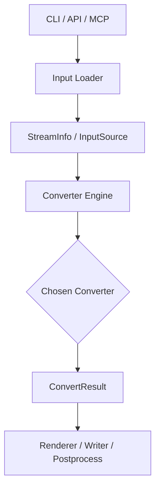

# MoonBitMark 架构改造方案

> **文档目的**：将 MoonBitMark 从“多格式转换工具”升级为“专业级文档转换引擎”

---

## 目录

- [1. 当前问题分析](#1-当前问题分析)
- [2. 目标架构愿景](#2-目标架构愿景)
- [3. 三层系统架构](#3-三层系统架构)
- [4. 分阶段改造方案](#4-分阶段改造方案)
- [5. 架构改造任务跟踪](#5-架构改造任务跟踪)
- [6. 当前整体进度汇报](#6-当前整体进度汇报)
- [7. 实施优先级](#7-实施优先级)
- [8. 改造前后对比](#8-改造前后对比)

---

## 1. 当前问题分析

### 1.1 核心问题：架构意图未落地

> 你已经开始设计架构了，但项目真正运行时，还没有按那套架构工作。

仓库中原本已存在“架构意图”：

| 组件 | 文件 | 初始状态 |
|------|------|------|
| 统一结果类型 | `src/core/types.mbt` | 已定义 `ConvertResult` |
| 输入信息 | `src/core/types.mbt` | 已定义 `StreamInfo` |
| 转换器接口 | `src/core/types.mbt` | 已定义 `DocumentConverter` trait |
| 主引擎 | `src/engine/engine.mbt` | 早期仅为占位实现 |

### 1.2 旧实现的实际问题

主程序最初仍采用硬编码分支：

```text
.txt  -> TextConverter::convert
.csv  -> CsvConverter::convert
.docx -> DocxConverter::convert
.epub -> EpubConverter::convert
URL   -> HTML converter
```

问题本质是：

- 系统真实运行路径不经过统一 engine
- CLI 直接知道所有格式细节，分层失效
- 错误、warning、metadata、stats 无法统一建模
- 新增格式必须改 CLI 主流程

---

## 2. 目标架构愿景

### 2.1 产品定位升级

| 现状 | 目标 |
|------|------|
| 多格式 Markdown 转换工具 | MoonBit 文档转换内核 |

### 2.2 目标特征

#### 特征 1：统一入口



#### 特征 2：统一转换器协议

```moonbit
trait DocumentConverter {
  name() -> String
  priority() -> Int
  accepts(info : StreamInfo) -> Bool
  convert(input : InputSource, ctx : ConvertContext) -> ConvertResult
}
```

#### 特征 3：统一结果模型

| 字段 | 作用 |
|------|------|
| `markdown` | 转换后的 Markdown 文本 |
| `title` | 文档标题 |
| `metadata` | 标准化元数据 |
| `warnings` | 面向用户的降级提示 |
| `diagnostics` | typed `phase/source/hint` 诊断 |
| `stats` | 转换统计 |

#### 特征 4：统一错误与诊断

目标错误形态：

```text
Error: XmlParseError
  Phase: epub/container
  Source: META-INF/container.xml
  Message: Invalid XML declaration encoding
  Hint: Try UTF-8 fallback or inspect archive integrity
```

#### 特征 5：统一扩展机制

新增格式时，应只注册 converter，不再修改 CLI 主流程。

---

## 3. 三层系统架构

```text
┌─────────────────────────────────────────────────────────┐
│                    Frontends (前端层)                  │
│  CLI / Web / MCP / API                                │
├─────────────────────────────────────────────────────────┤
│                 Core Engine (核心层)                  │
│  输入识别 / converter 注册 / 选择 / diagnostics /      │
│  stats / metadata / render / postprocess              │
├─────────────────────────────────────────────────────────┤
│              Format Adapters (格式适配层)             │
│  TXT / CSV / JSON / PDF / HTML / DOCX / PPTX / XLSX / │
│  EPUB / ...                                           │
└─────────────────────────────────────────────────────────┘
```

核心原则：CLI 只是前端，不再是系统核心。

---

## 4. 分阶段改造方案

### 阶段一：架构意图落地

- 扩充 `ConvertResult`、`ConvertContext`、`InputSource`
- 重写 `DocumentConverter` 接口
- 新建独立 `src/engine/` 作为统一入口
- 将 metadata / stats / diagnostics 统一纳入结果模型

### 阶段二：CLI 降级为前端

- CLI 负责参数解析、调用 engine、写输出
- CLI 不再直接判断 DOCX / EPUB / PPTX / XLSX 等格式细节
- 前端参数通过 `ConvertContext` 透传给 engine

### 阶段三：引入 AST 中间表示

- 各格式从“直接拼 Markdown”逐步改为“转 Document AST，再交给 renderer”
- 先接入 HTML / DOCX / EPUB，再逐步推广到更多格式

### 阶段四：诊断系统

- warning 与 error 从字符串约定改为 typed diagnostics
- `phase/source/hint` 不再靠调用方手写字符串拼接
- engine 对标准化错误文本支持透传，而不是二次泛化包裹

### 阶段五：转换流水线

```text
Load -> Detect -> Parse -> Normalize -> Render -> Postprocess
```

- Load：读文件 / 拉 URL / 解 archive
- Detect：扩展名、MIME、内部结构识别
- Parse：转领域对象 / AST
- Normalize：空白、标题、表格等归一化
- Render：输出 Markdown
- Postprocess：frontmatter、资源路径改写、资产落盘

### 阶段六：注册机制

- engine 内部已支持注册表与集中注册
- 后续可继续抽象为独立插件边界

### 阶段七：资源与元数据输出

- 输出模式支持普通 Markdown、纯文本、frontmatter
- `asset_output_dir` 负责资源提取与路径回写

---

## 5. 架构改造任务跟踪

> 状态说明：
> - `[x]` 已完成
> - `[~]` 已部分完成
> - `[ ]` 未开始

### P0：必须做

- [x] Core Engine 接管主流程
  当前状态：已新增独立 `src/engine/` 包，由引擎负责输入识别、converter 注册、选择与调度执行，并统一做 metadata、stats、diagnostics、output mode 与 postprocess。
- [x] CLI 只调用 engine
  当前状态：`cmd/main/main.mbt` 已移除格式分支，改为解析参数后统一调用 engine。
- [x] 所有 converter 返回 `ConvertResult`
  当前状态：text/csv/json/pdf/html/docx/pptx/xlsx/epub 已统一返回 `ConvertResult`，并实际填充 markdown、title、metadata、warnings、stats 等字段。
- [~] 统一错误/警告模型
  当前状态：typed `ConversionDiagnostic`、`ConversionPhase`、`DiagnosticSource`、`DiagnosticHint` 已落地；engine 与主要 converter 已接入统一链路。当前主缺口已不在顶层接口，而在错误分类粒度、诊断展示与开发者可视化层。

### P1：强烈建议

- [~] HTML/DOCX/EPUB 接入 AST
  当前状态：已新增 `src/ast/` 与统一 renderer；HTML 已直接生成 AST block，DOCX/EPUB 与 text/csv/json/pdf/pptx/xlsx 也都已进入 `Document -> renderer` 主链路。当前 `markdownish` 主要只剩 AST 包内的兼容工具与测试用途，不再是主线 converter 的依赖。
- [x] 转换 stats / metadata 输出
  当前状态：`ConvertStats`、`ConvertContext`、`source_type`、主要 metadata 字段已实际接入主链路。
- [~] Converter 注册表
  当前状态：引擎内部已具备 `ConverterKind`、`ConverterRegistration`、`register/register_named` 等机制；外部插件式注册仍未开放。

### P2：冲刺加分

- [x] 支持 frontmatter 输出
- [x] 支持资源提取目录
  当前状态：engine 已支持把 converter 返回的 `OutputAsset` 统一落盘，并处理 Markdown 中的 `data:image/*;base64,...` 回写相对链接；DOCX / EPUB / PPTX / XLSX 已统一把 archive 内原生图片与附件接入 `assets`，由 engine 统一写盘与回写相对链接。
- [~] Web demo / MCP 对接展示
  当前状态：Web demo 仍未开始；MCP 已新增 `src/mcp/` 与 `cmd/mcp-server`，具备 `initialize`、`tools/list`、`tools/call` 与 `convert_to_markdown` 的基础链路，但仍属于最小可用集成，尚未补齐更多工具、展示与集成验证。
- [ ] Benchmark 和 diagnostics 展示

### 当前改造范围备注

已落地的关键代码区域：

- `src/core/types.mbt`
- `src/engine/engine.mbt`
- `src/ast/*`
- `cmd/main/main.mbt`
- 各 `src/formats/*/converter.mbt`
- `src/formats/pptx/parser.mbt`
- `src/formats/pptx/slide.mbt`
- `src/libzip/*`
- `src/xml/*`

当前已完成的校验：

- `moon info`
- `moon fmt`
- `moon check`
- 多个 package 的 targeted `moon test`

当前已知残留项：

- 主线 converter 已不再依赖 `document_of_markdownish(...)`，但 AST 包仍保留 `markdownish` 兼容工具
- Web 展示层仍未接入；MCP 仅为最小可用能力，尚未扩展更多工具与集成验证
- diagnostics / benchmark / 开发者可视化仍未成体系
- 当前 `moon check` 已无已知 warning / error

---

## 6. 当前整体进度汇报

截至 2026-03-18，可以把整体改造进度概括为：

### 6.1 已完成的核心成果

1. 统一 engine 已真正接管主流程。
2. CLI 已退化为前端，不再承担格式判断与 converter 调度职责。
3. `ConvertResult` / `ConvertContext` / typed diagnostics 已成为主链路标准模型。
4. archive 类格式关键失败路径已能生成统一 `phase/source/hint` 错误信息。
5. HTML、DOCX、EPUB 已接入 AST / renderer 主链路，text/csv/json/pdf/pptx/xlsx 也已切到 AST/renderer 输出链路。
6. `asset_output_dir` 已从 context 字段推进为真实后处理能力，可将 converter 产出的 `OutputAsset` 与 data URI 图片落盘。
7. DOCX / EPUB / PPTX / XLSX 已统一把 archive 内原生图片与附件接入 `assets`，不再只有 data URI 或单格式特例。
8. MCP 基础服务链路已落地，能够通过独立入口把 engine 暴露为 `convert_to_markdown` 工具。
9. 当前 `moon check` 已无已知 warning / error。

### 6.2 还未完成但已明确的缺口

1. 主线 AST 输出链路已经打通，但 AST 包内仍保留 `markdownish` 兼容工具，后续可继续评估是否缩小其职责或转为仅测试辅助。
2. 外部插件化注册与 Web demo 仍未完成；MCP 虽已接入，但还不是完整产品化能力。
3. diagnostics 展示、benchmark、开发者可视化工具仍欠缺。

### 6.3 当前优先级判断

从架构收益看，下一阶段最有价值的工作是：

1. 继续细化 typed diagnostics 的分类质量与展示能力，而不是只停留在统一结构层
2. 补全 MCP 的工具面与集成验证，或正式启动 Web demo，形成可演示前端层
3. 在此基础上补 benchmark、诊断展示与开发者可视化工具，提升工程可信度

---

## 7. 实施优先级

### P0：必须做

| 序号 | 任务 | 收益 |
|------|------|------|
| 1 | Core Engine 接管主流程 | 所有改造的起点 |
| 2 | CLI 只调用 engine | 系统分层清晰 |
| 3 | 所有 converter 返回 `ConvertResult` | 结果统一 |
| 4 | 统一错误/警告模型 | 显著提升专业感 |

### P1：强烈建议

| 序号 | 任务 | 收益 |
|------|------|------|
| 5 | HTML / DOCX / EPUB 接入 AST | 建立统一内容模型 |
| 6 | stats / metadata 输出 | 提升调试与展示能力 |
| 7 | Converter 注册表 | 体现扩展性 |

### P2：冲刺加分

| 序号 | 任务 | 收益 |
|------|------|------|
| 8 | frontmatter 输出 | 提升前端能力完整性 |
| 9 | asset_output_dir | 资源输出完整性 |
| 10 | Web / MCP 展示 | 演示效果 |
| 11 | benchmark / diagnostics 展示 | 性能与工程可信度 |

---

## 8. 改造前后对比

### 改造前

```text
CLI
 ├─ if txt  -> TextConverter
 ├─ if csv  -> CsvConverter
 ├─ if json -> JsonConverter
 ├─ if docx -> DocxConverter
 ├─ if epub -> EpubConverter
 └─ ...
```

### 改造后

```text
CLI
 └─ Engine.convert(input, context)
      -> detect input info
      -> choose converter
      -> convert to AST / normalized result
      -> render markdown
      -> postprocess output and assets
      -> return ConvertResult
```

改造后的稳定收益：

- 前端与格式实现解耦
- diagnostics / warnings / metadata / stats 可以统一生产与展示
- output mode、frontmatter、asset_output_dir 这类前端能力可以在 engine 后处理阶段统一实现
- 新增格式时，不再把复杂度堆回 CLI

---

## 附录：快速参考

### 关键文件路径

| 文件 | 职责 |
|------|------|
| `src/core/types.mbt` | 核心类型定义 |
| `src/engine/engine.mbt` | 统一引擎与后处理 |
| `src/ast/*` | AST 与 renderer |
| `src/formats/*/converter.mbt` | 各格式转换器 |
| `cmd/main/main.mbt` | CLI 前端 |

### 相关文档

- [已知问题](./KNOWN_ISSUES.md)
- [架构改造经验总结](./Architecture%20refactor%20lessons%20learned.md)
- [远程推送记录](./Remote%20push%20log.md)
- [项目指南](../AGENTS.md)
